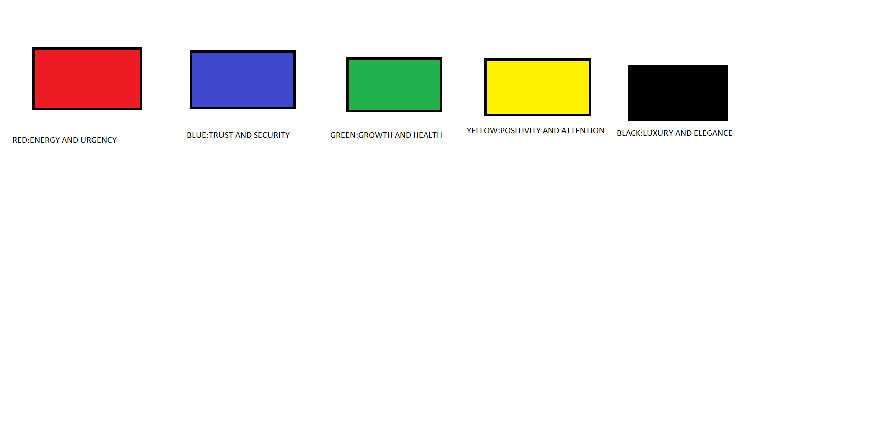
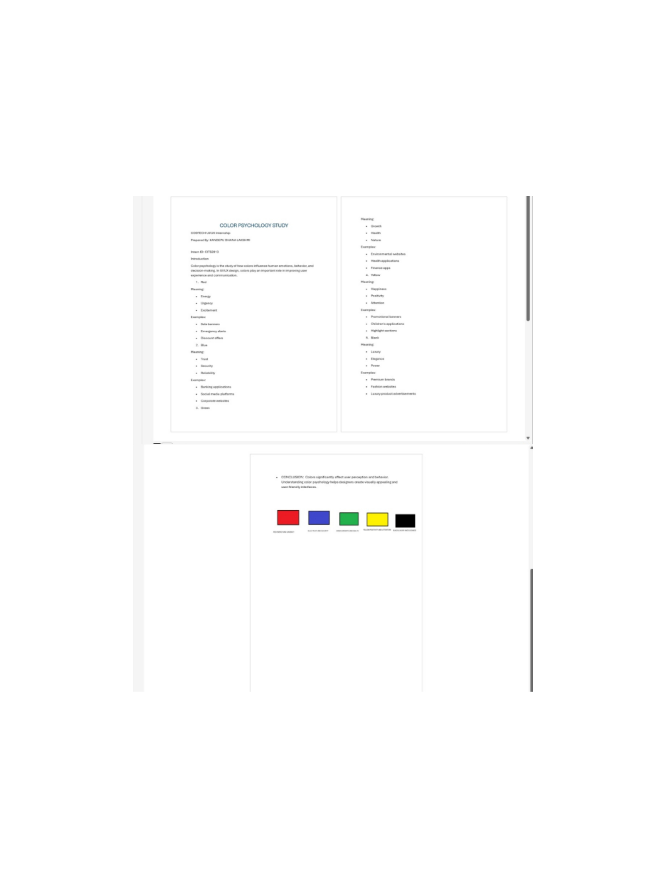

# CODTECH UI/UX Internship Task-2

## Color Psychology Study

Company: CODTECH IT SOLUTIONS

Intern Name: TALLAM HARIKA

Intern ID: CITS2799

Domain: UI/UX Design

Duration: 8 Weeks

Mentor Name: Neela Santosh Kumar

## Objective

The objective of this project is to study the impact of colors on user emotions, behavior, and decision-making in UI/UX design.

## Description

This project explores how different colors influence user perception and experience. The study focuses on five commonly used colors: Red, Blue, Green, Yellow, and Black, along with their meanings and practical applications.

## Colors Studied

* Red – Energy and Urgency
* Blue – Trust and Security
* Green – Growth and Health
* Yellow – Positivity and Attention
* Black – Luxury and Elegance

## Tools Used

* Microsoft Word
* Canva
* Google Images

## Files in Repository

* Color Psychology Study Report.pdf
* proof1.png
* proof2.png
* README.md

## Conclusion

Color psychology is an important aspect of UI/UX design. Proper color selection improves usability, engagement, and user satisfaction.

## Proof of Execution

### Proof 1 – Color Psychology Chart

### Proof 2 – Color Psychology Study Report

### Proof 3 – GitHub Repository Upload

.png?raw=true)
